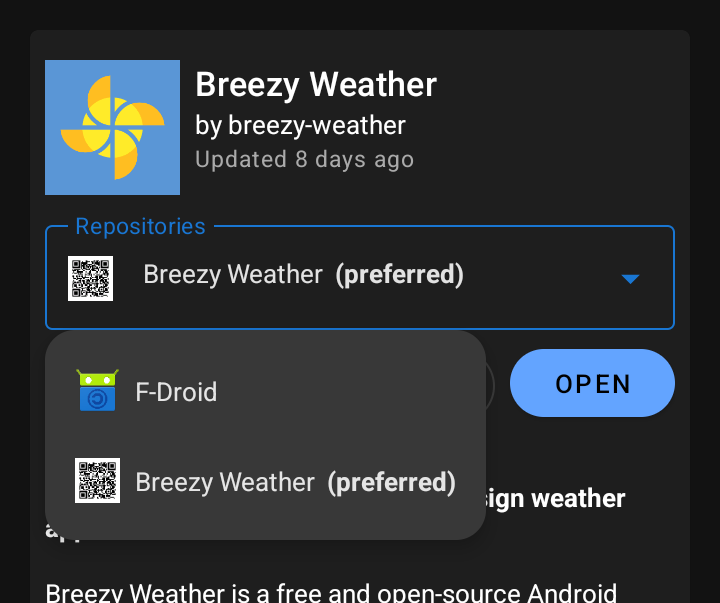

# Simple instructions

Go to [Releases page](https://github.com/breezy-weather/breezy-weather/releases) and download the file with the following format `breezy-weather-vX.Y.Z_standard.apk`.

Install it and you’re done!

After adding your first location, you will be asked if you want to be notified of app updates. We highly recommend you enable it.

# Detailed instructions

## Flavors

The recommended flavor of **Breezy Weather** is the standard version. It is fully open source and contains no proprietary components.

For specific needs, we also offer a flavor with only free-network sources (libre and self-hostable): Open-Meteo, Bright Sky (DWD) and Recosanté.

Both flavors are signed with the same signature, so you can easily try/switch between both.

## Sources to get Breezy Weather from

**Breezy Weather** releases are available from the following sources:
- **[GitHub releases](https://github.com/breezy-weather/breezy-weather/releases)** is where releases built by GitHub are published under APK format. Any Android device can install APK files without needing any particular app. If you have a GitHub account, you can subscribe to be notified of updates, however it’s more convenient to use a store app to track updates.
- **[Breezy Weather’s F-Droid repositories](https://github.com/breezy-weather/fdroid-repo/blob/main/README.md)** are maintained by Breezy Weather developers and get updates from a F-Droid client that doesn’t support receiving updates from GitHub.
- **[Izzy F-Droid repository](https://apt.izzysoft.de/fdroid/index/info)** offers the standard flavor which is our recommended choice if you would like someone to independently review the app before it gets published. Updates are fast (less than 24 hours).
- **[F-Droid default repository](https://f-droid.org/packages/org.breezyweather/)** offers the flavor with only free-network sources. Updates are slower as it requires someone on F-Droid team to manually add new versions, as autoupdates cannot be enabled for technical reasons. If you decide to use this source and you want to report an issue, you will be asked to update to the latest version before making the report.

| Differences             | GitHub releases | [F-Droid repo] Breezy Weather | [F-Droid repo] Izzy    | [F-Droid repo] Default    |
|-------------------------|-----------------|-------------------------------|------------------------|---------------------------|
| Available flavors       | All             | All                           | Standard               | Free network sources-only |
| Pre-releases            | Optional        | Optional                      | ❌                      | ❌                         |
| Delay for updates       | Immediate       | Immediate                     | Every day at 18:00 UTC | Very slow (manual)        |
| APK matches source code | ✅               | ✅                             | ✅                      | ✅                         |
| Independently reviewed  | ❌               | ❌                             | ✅                      | ✅                         |

### Other not supported well-known sources

- Google Play Store:
  - Costs money
  - Is privacy invasive for the developer (requires sending your ID and giving your phone number)
  - We don’t [comply with Google Play policy](https://github.com/breezy-weather/breezy-weather/issues/31)
- Accrescent: waiting for it to become stable (no ETA announced by upstream)

## Client configuration instructions

### Obtainium

[Link to Obtainium page](https://github.com/ImranR98/Obtainium/blob/main/README.md)

#### Getting updates from GitHub releases

In the “Add App” screen:
1. Add the following URL: https://github.com/breezy-weather/breezy-weather
2. To receive updates for prereleases, enable “Include prereleases”
3. (Optional) If you want the flavor with only free network sources, add `freenet` in the “Filter APKs by Regular Expression”
4. Tap the “Add” button at the very top, and you’re done!

#### Getting updates from a F-Droid repository

In the “Add App” screen, just add as App Source URL the following URL depending on the repository you want to use:
   - Standard flavor from Izzy repo: https://apt.izzysoft.de/fdroid/index/apk/org.breezyweather
   - Standard flavor from Breezy Weather repo: configure Obtainium to use GitHub releases instead (see previous section)
   - Free-net flavor from Breezy Weather repo: configure Obtainium to use GitHub releases instead (see previous section)
   - Free-net flavor from default F-Droid repo: https://f-droid.org/packages/org.breezyweather/

Tap the “Add” button at the very top, and you’re done!

### F-Droid client

1) Look for the Repositories option from your F-Droid client and add a new repository depending on the source you want to use:
   - Standard flavor from Izzy repo: https://apt.izzysoft.de/fdroid/repo
   - Standard flavor from Breezy Weather repo: https://breezy-weather.github.io/fdroid-repo/fdroid/repo
   - Free-net flavor from Breezy Weather repo: https://breezy-weather.github.io/fdroid-repo/fdroid-version/fdroid/repo
   - Free-net flavor from default F-Droid repo: should already be enabled by default on your F-Droid client

2) After adding the app, go to the app details and make sure to select which repo you want to get updates from to avoid cross-updates between flavors and repos. On version 1.20.0 and later, this is how you do it:

