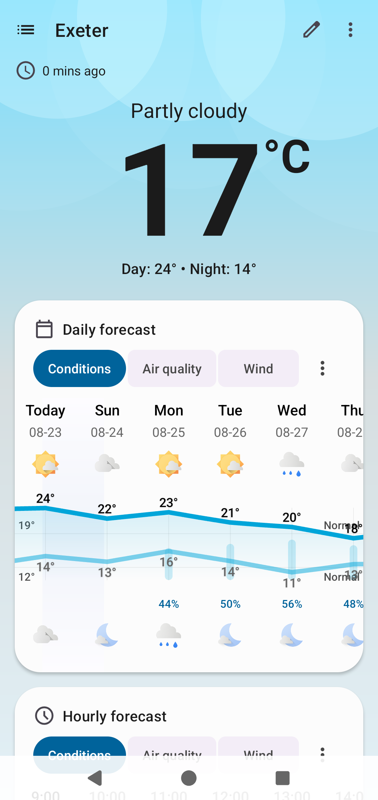
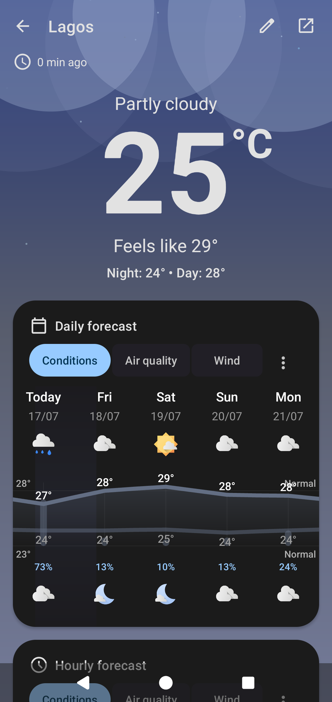
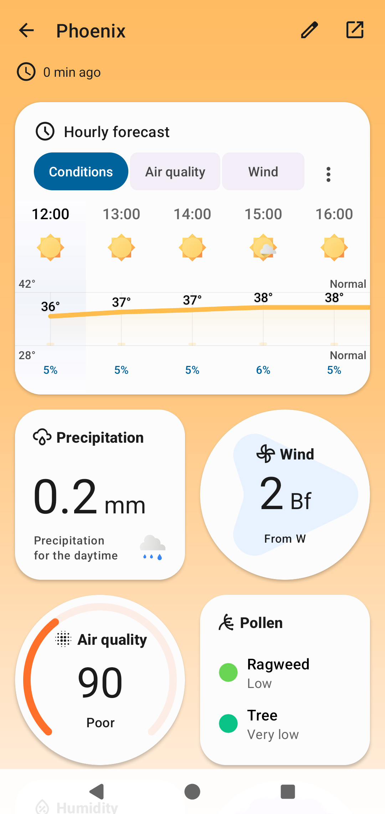
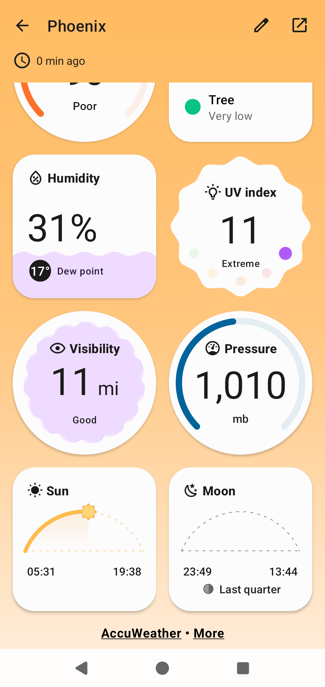
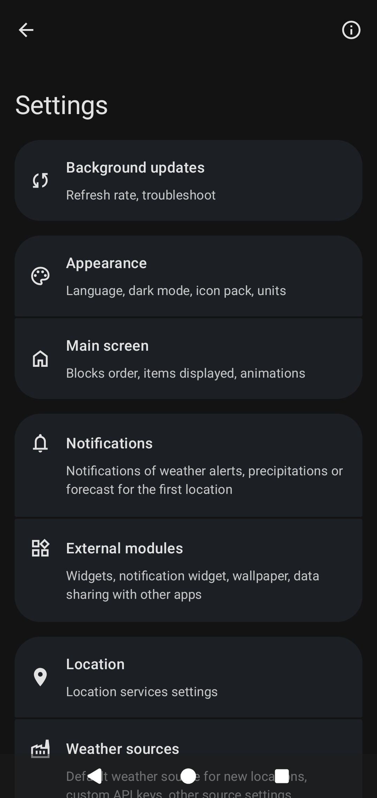
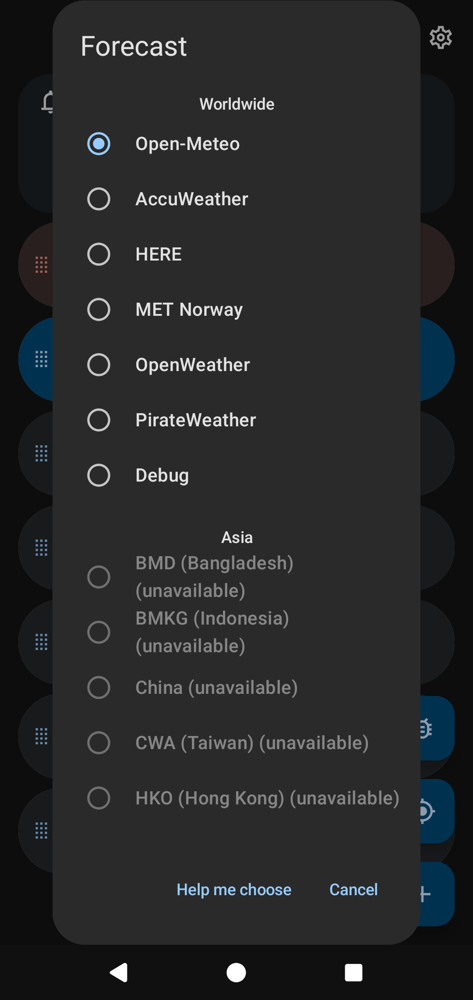
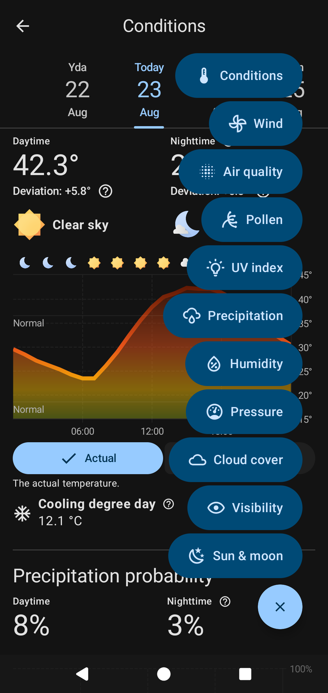

 

<h1 align="center">Breezy Weather</h1>

 

  
  
  
  
   
  
  
    
  
  
  

<h4 align="center">Breezy Weather is a featureful free and open source Material 3 Expressive weather app with well-though-out visualizations, supporting forecast, observations, nowcasting, air quality, pollen, alerts, from more than 50 weather sources.</h4>

# Download

    
<a href="https://github.com/breezy-weather/breezy-weather/blob/main/INSTALL.md"><strong>All installation methods</strong></a>

  
<strong>SHA-256 hash of the signing certificate:</strong> 29d435f70aa9aec3c1faff7f7ffa6e15785088d87f06ecfcab9c3cc62dc269d8 
  SHA-256 checksums are also provided per file on the <a href="https://github.com/breezy-weather/breezy-weather/releases">GitHub releases page</a>.

    
    
    
    
    
    
    

# Features

- Weather data
  - Daily and hourly forecasts up to 16 days
  - Precipitation in the next hour
  - Severe weather and precipitation alerts
  - Temperature / Feels like temperature / Normals
  - Precipitation
  - Wind
  - Air quality
  - Pollen & Mold
  - Humidity
  - UV index
  - Visibility
  - Pressure
  - Sun
  - Moon
- Visualization
  - Detailed 24-hour charts
  - Material 3 Expressive blocks
- More than 50 weather sources supported (<a href="docs/SOURCES.md">full list</a>)
- Large selection of widgets
- Live wallpaper
- Custom icon packs
  - [Geometric Weather icon packs](https://github.com/breezy-weather/breezy-weather-icon-packs/blob/main/README.md)
  - Chronus Weather icon packs
- Automatic dark mode
- Opt-in data sharing with other apps (such as Gadgetbridge)
- 

Accessibility

  - Localization
    - Number formatting (different numeral systems, decimal separator, thousand separator)
    - Unit formatting
    - Alternate calendar
  - Readability
    - Good content descriptions for screen readers
    - Navigation with screen readers: most things should work, features depending on drag & drop not yet supported
    - Custom display settings: basic support

- 

Free and Open Source

  - No proprietary blobs/dependencies
  - Releases generated by GitHub actions, guaranteeing it matches the source code
  - Fully works with Open-Meteo (FOSS source)

- 

Privacy-friendly

  - No personal data collected by the app ([link to app privacy policy](https://github.com/breezy-weather/breezy-weather/blob/main/PRIVACY.md))
  - Multiple sources are available, with links to their privacy policies for transparency
  - Current location is optional and not added by default
  - If using current location, an IP location service can be used instead of GPS to send less accurate coordinates to weather source
  - No trackers/automatic crash reporters

# Help

* [Frequently Asked Questions / Help](HELP.md)
* [Main screen explanations](docs/HOMEPAGE.md)
* [Weather sources comparison](docs/SOURCES.md)

# Contribute

Pull requests are welcome. You can have a look at [issues opened to contributions](https://github.com/breezy-weather/breezy-weather/issues?q=is%3Aissue+is%3Aopen+label%3A%22Open+to+contributions%22). For other changes, please open an issue first to discuss what you would like to change.

* [Contribution guide (includes a guide to create a new weather source)](CONTRIBUTE.md)

## Features currently being worked on by a contributor

- [#863](https://github.com/breezy-weather/breezy-weather/issues/863) - Make Breezy weather data available through a ContentProvider

## Features lacking an active contributor

- [#10](https://github.com/breezy-weather/breezy-weather/issues/10) - “Add location” page needs a new design, in the spirit of Google Maps where you can select location points on the map, or search manually - No mockup done yet
- [#937](https://github.com/breezy-weather/breezy-weather/issues/937) - Widget overhaul (prerequisite for any new widget improvement) - Some mockups were done but no one is working on it anymore

## Features that will not be implemented

- Paid-only sources, too limited free-tier, or free-tier that requires privacy-invasive information (credit card info, phone number, etc)
- Radar; [please check out this document for alternatives](docs/RADAR.md)
- Adding `standard` flavor or non-free sources to the F-Droid default repo: please use the `standard` flavor from a different store/source instead
- Changes to the [background updates process](docs/UPDATES.md), including but not limited: options for refreshing less than every 30 minutes, every time you open the app, every time you tap on widget, every time you unlock your phone
- “Circular sky” interface: please set a fixed background per location instead
- Publish to Google Play Store: please [check alternatives](INSTALL.md)
- Allow different flavors to be installed in parallel
- Implement features that are no longer available in latest Android versions
- Backport features/fixes from latest Android versions to older Android versions
- Donations: if you have extra money to spare, consider [donating to Open-Meteo](https://github.com/sponsors/open-meteo) to support infrastructure costs and future developments (we currently lack a libre and gratis worldwide alternative for the following features: [Reverse geocoding](https://github.com/open-meteo/geocoding-api/issues/6), [Alerts](https://github.com/open-meteo/open-meteo/issues/351), [Normals](https://github.com/open-meteo/open-meteo/issues/361))

# Translations

Translation is done externally [on Weblate](https://hosted.weblate.org/projects/breezy-weather/breezy-weather-android/#information). Please read carefully project instructions if you want to help.

English (and regional variants) and French translations are maintained by repo maintainers, but they are open to proofreading/improvements. You will need to make a pull request, as we didn’t find a way to make these languages in suggestion-only mode in Weblate (let us know if you find anything).

# Contact us

* If you’d like to report a bug or suggest a new feature, GitHub discussions or issues are best for organization.
* We’ve also created a Matrix/Element space with a number of different channels for more general discussion: [`#breezy-weather-space:matrix.org`](https://matrix.to/#/#breezy-weather-space:matrix.org).
  * If you are not comfortable writing a GitHub discussion/issue in English, you can ask on the channel if someone can help you in your language.
    * We also have a dedicated help channel in French: [`#breezy-weather-francais:matrix.org`](https://matrix.to/#/#breezy-weather-francais:matrix.org)
  * If you’d prefer a direct channel link instead of a space link, here’s the main Breezy Weather Matrix channel: [`#breezy-weather:matrix.org`](https://matrix.to/#/#breezy-weather:matrix.org)

# License

* [GNU Lesser General Public License v3.0](/LICENSE)
* This License does not grant any rights in the trademarks, service marks, or logos of any Contributor.
* Misrepresentation of the origin of that material is prohibited, and modified versions of such material must be marked in reasonable ways as different from the original version.

Before creating a fork, check if the intent action `nodomain.freeyourgadget.gadgetbridge.ACTION_GENERIC_WEATHER` can cover your need (for example, you want to re-use our weather data in your own customized widget). It can be enabled from Settings > Widgets & Live Wallpaper > Data sharing. We also have [plans to expose the full weather data of Breezy Weather](https://github.com/breezy-weather/breezy-weather/issues/863).

Otherwise, remember to:

- Respect the project’s LICENSE
- Avoid confusion with Breezy Weather app:
  - Change the app name
  - Change the app icon
- Avoid installation conflicts:
  - Change the `applicationId` in [`build.gradle.kts`](https://github.com/breezy-weather/breezy-weather/blob/main/app/build.gradle.kts#L24)
