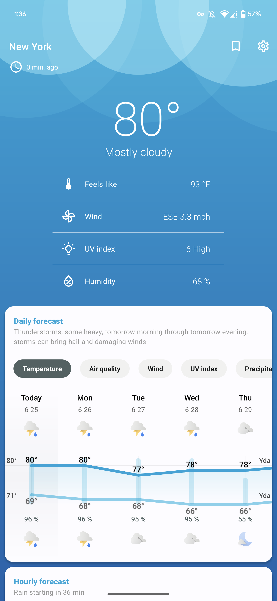

 

<h1 align="center">Breezy Weather</h1>

 

  
  
  
  
   
  
  
    
  
  

<h4 align="center">Breezy Weather is a weather app with a strong focus on design, with a simple, clean UX, smooth animations, and Material Design all over, plus lots of customizability.</h4>

    

# Download

# Features

- Weather data
    - Daily and hourly forecasts up to 16 days
      - Temperature
      - Air quality
      - Wind
      - UV index
      - Precipitation
    - Precipitation in the next hour
    - Air quality
    - Pollen & Mold
    - Ephemeris (Sun & Moon)
    - Severe weather and precipitation alerts
    - Real-time weather conditions
      - Temperature
      - Feels like
      - Wind
      - UV index
      - Humidity
      - Dew point
      - Atmospheric pressure
      - Visibility
      - Cloud cover
      - Ceiling

- 

Multiple weather sources (<a href="docs/SOURCES.md">comparison</a>)

  - Open-Meteo
  - AccuWeather
  - MET Norway
  - OpenWeatherMap (often rate-limited)
  - Pirate Weather (no API key provided)
  - HERE (no API key provided)
  - Météo France
  - Mixed China sources

- Large selection of home screen widgets for at-a-glance information
- Live wallpaper
- Custom icon packs
  - [Geometric Weather icon packs](https://github.com/breezy-weather/breezy-weather-icon-packs/blob/main/README.md)
  - Chronus Weather icon packs
- Automatic dark mode

- 

Free and Open Source

  - No proprietary blobs/dependencies
  - Releases generated by GitHub actions, guaranteeing it matches the source code
  - Fully works with Open-Meteo (FOSS source)

- 

Privacy-friendly

  - No personal data collected by the app ([link to app privacy policy](https://github.com/breezy-weather/breezy-weather/blob/main/PRIVACY.md))
  - Multiple sources are available, with links to their privacy policies for transparency
  - Current location is optional and not added by default
  - If using current location, an IP location service can be used instead of GPS to send less accurate coordinates to weather source
  - No trackers/automatic crash reporters

# Help

* [Frequently Asked Questions / Help](HELP.md)
* [Homepage explanations](docs/HOMEPAGE.md)
* [Weather sources comparison](docs/SOURCES.md)

# Contribute

Pull requests are welcome. For major changes, please open an issue first to discuss what you would like to change.

* [Contribution guide (includes a guide to create a new weather source)](CONTRIBUTE.md)

# Translations

Translation is done externally [on Weblate](https://hosted.weblate.org/projects/breezy-weather/breezy-weather-android/#information). Please read carefully project instructions if you want to help.

* English regional variants must be updated on GitHub if they differ from the original English file
* French translation is maintained by repo maintainers

# Contact us

* If you’d like to report a bug or suggest a new feature, GitHub discussions or issues are best for organization.
* We’ve also created a Matrix/Element space with a number of different channels for more general discussion: [`#breezy-weather-space:matrix.org`](https://matrix.to/#/#breezy-weather-space:matrix.org)
* If you’d prefer a direct channel link instead of a space link, here’s the main Breezy Weather Matrix channel: [`#breezy-weather:matrix.org`](https://matrix.to/#/#breezy-weather:matrix.org)

# Build variant

A variant called `gplay` is available and may be distributed on Google Play Store in the future.
It enables Instant App and bundles Google Network Location Provider (proprietary).

# License

* [GNU Lesser General Public License v3.0](/LICENSE)
* [Additional license terms](/LICENSE_ADDITIONAL)
* [Guidelines regarding Breezy Weather identity and forks](/IDENTITY.md)
* [Built on Geometric Weather Android app (GNU Lesser General Public License v3.0)](https://github.com/WangDaYeeeeee/GeometricWeather). Breezy Weather is not officially associated with Geometric Weather or its products.

